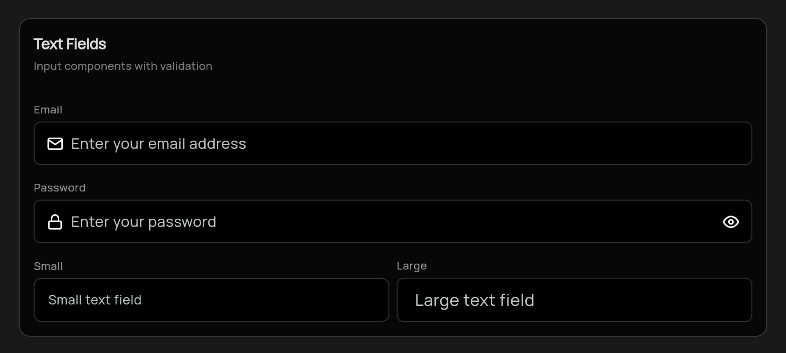

# Hux UI

A modern Flutter UI package with beautiful, customizable components designed for clean and consistent user interfaces.

[](https://pub.dev/packages/hux)
[](https://pub.dev/packages/hux/score)
[](https://pub.dev/packages/hux/score)
[](https://flutter.dev/)
[](https://flutter.dev/)
[](https://opensource.org/licenses/MIT)

## Features

- 🎨 **Modern Design** - Clean, minimal design language
- 🌙 **Dark Mode Support** - Built-in light and dark theme support
- 📊 **Data Visualization** - Beautiful animated charts for data presentation
- 📱 **Responsive** - Components adapt to different screen sizes
- 🎯 **Customizable** - Extensive customization options
- 🚀 **Easy to Use** - Simple, intuitive API

## Components

### Buttons
- `HuxButton` - Customizable button with multiple variants (primary, secondary, outline, ghost)
- Multiple sizes (small, medium, large)
- Loading states and icon support


### Cards
- `HuxCard` - Flexible card component with optional header, title, and actions
- Customizable padding, margin, and border radius
- Tap handling support


### Inputs
- `HuxTextField` - Enhanced text input with consistent styling
- Label, helper text, and error state support
- Multiple sizes and validation



### Widgets
- `HuxLoading` - Customizable loading indicators
- `HuxLoadingOverlay` - Full-screen loading overlay


- `HuxChart` - Beautiful data visualization with line and bar charts


### Context Menu
- `HuxContextMenu` - Right-click context menus with smart positioning
- `HuxContextMenuItem` - Individual menu items with icons and states  
- `HuxContextMenuDivider` - Visual separators for menu groups
- Cross-platform support with proper web context menu handling


*Right-click the example app components to see context menus in action!*

### Theme
- `HuxTheme` - Pre-configured light and dark themes
- `HuxColors` - Comprehensive color palette

## Installation

```bash
flutter pub add hux
```


## Usage

### Basic Setup

Wrap your app with the Hux theme:

```dart
import 'package:flutter/material.dart';
import 'package:hux_ui/hux.dart';

void main() {
  runApp(MyApp());
}

class MyApp extends StatelessWidget {
  @override
  Widget build(BuildContext context) {
    return MaterialApp(
      title: 'Hux UI Demo',
      theme: HuxTheme.lightTheme,
      darkTheme: HuxTheme.darkTheme,
      home: MyHomePage(),
    );
  }
}
```

### Using Components

#### Button

```dart
HuxButton(
  onPressed: () => print('Button pressed'),
  child: Text('Primary Button'),
  variant: HuxButtonVariant.primary,
  size: HuxButtonSize.medium,
  icon: Icons.star,
)
```

#### Text Field

```dart
HuxTextField(
  label: 'Email',
  hint: 'Enter your email',
  prefixIcon: Icon(Icons.email),
  onChanged: (value) => print(value),
  validator: (value) {
    if (value == null || value.isEmpty) {
      return 'Please enter your email';
    }
    return null;
  },
)
```

#### Card

```dart
HuxCard(
  title: 'Card Title',
  subtitle: 'Card subtitle',
  action: IconButton(
    icon: Icon(Icons.more_vert),
    onPressed: () {},
  ),
  child: Text('Card content goes here'),
  onTap: () => print('Card tapped'),
)
```

#### Loading

```dart
// Simple loading indicator
HuxLoading(size: HuxLoadingSize.medium)

// Loading overlay
HuxLoadingOverlay(
  isLoading: true,
  message: 'Loading...',
  child: YourContent(),
)
```

#### Charts

```dart
// Line chart
HuxChart.line(
  data: [
    {'x': 1, 'y': 10},
    {'x': 2, 'y': 20},
    {'x': 3, 'y': 15},
  ],
  xField: 'x',
  yField: 'y',
  title: 'Sales Over Time',
  subtitle: 'Monthly data',
  primaryColor: Colors.blue,
)

// Bar chart
HuxChart.bar(
  data: [
    {'category': 'A', 'value': 30},
    {'category': 'B', 'value': 45},
    {'category': 'C', 'value': 25},
  ],
  xField: 'category',
  yField: 'value',
  title: 'Category Analysis',
)
```

#### Context Menu

```dart
HuxContextMenu(
  menuItems: [
    HuxContextMenuItem(
      text: 'Copy',
      icon: Icons.copy,
      onTap: () => print('Copy action'),
    ),
    HuxContextMenuItem(
      text: 'Paste',
      icon: Icons.paste,
      onTap: () => print('Paste action'),
      isDisabled: true,
    ),
    const HuxContextMenuDivider(),
    HuxContextMenuItem(
      text: 'Delete',
      icon: Icons.delete,
      onTap: () => print('Delete action'),
      isDestructive: true,
    ),
  ],
  child: Container(
    padding: const EdgeInsets.all(20),
    child: const Text('Right-click me!'),
  ),
)
```

## Customization

All components can be customized using the provided parameters. For more advanced customization, you can extend the theme or override specific component styles.

### Custom Colors

```dart
// Access predefined colors
Container(
  color: HuxColors.primary,
  child: Text('Primary colored container'),
)
```

## Contributing

Contributions are welcome! Please feel free to submit a Pull Request.

## License

This project is licensed under the MIT License - see the LICENSE file for details.
