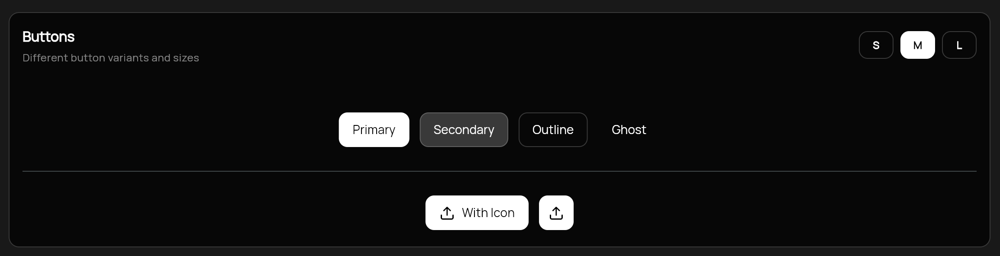
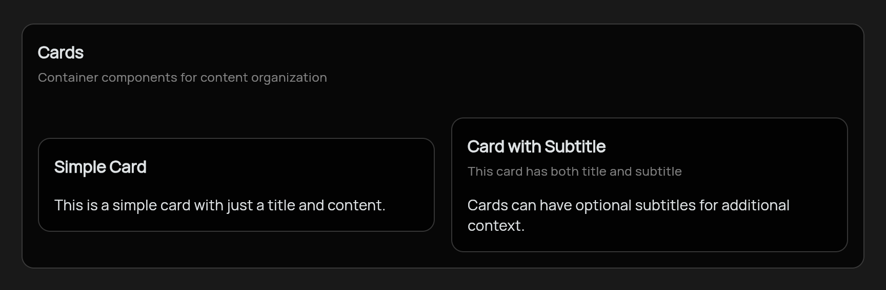
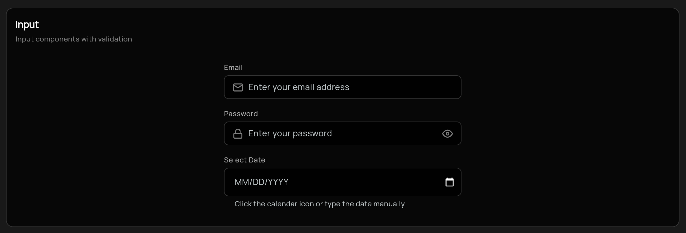
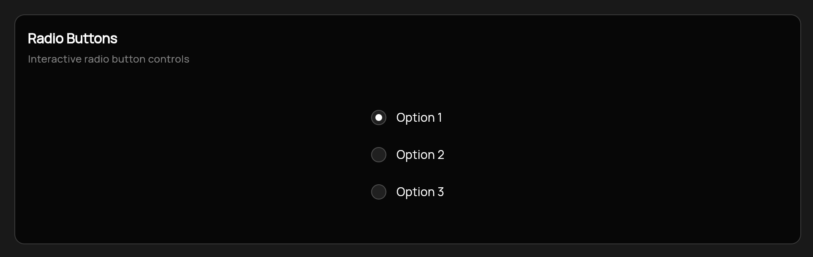
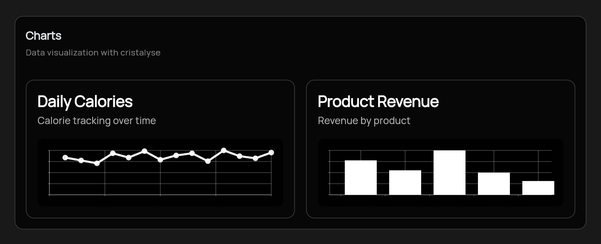
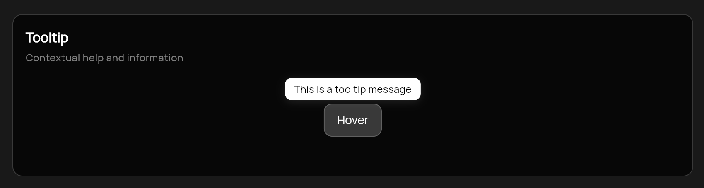
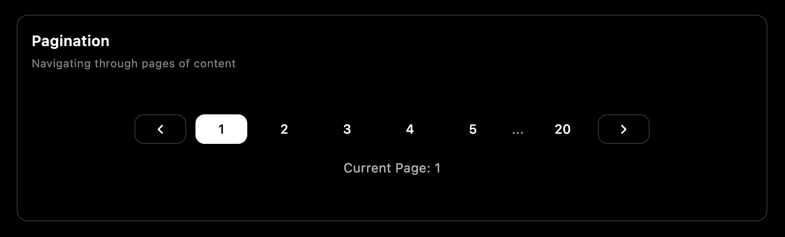

# 

A modern Flutter UI package with beautiful, customizable components designed for clean and consistent user interfaces.

[](https://flutter.dev/)
[](https://www.figma.com/community/file/1541197128732135637/the-hux-ui)
[](https://github.com/sponsors/zoeglbrt)

[](https://pub.dev/packages/hux)
[](https://pub.dev/packages/hux/score)
[](https://pub.dev/packages/hux/score)
[](https://pub.dev/packages/hux/score)
[](https://flutter.dev/)
[](https://opensource.org/licenses/MIT)


## Latest Version: 0.15.0

- **HuxTabs Component**: New tab navigation component with multiple variants
  - Three visual variants: Default, Pill, and Minimal styles
  - Support for icons, badges, and custom content
  - Built-in theme integration and accessibility support

[](CHANGELOG.md)
[](https://docs.thehuxdesign.com)

## Features

- **Modern Design** - Clean, minimal design language
- **Dark Mode Support** - Built-in light and dark theme support
- **Data Visualization** - Beautiful animated charts for data presentation
- **Responsive** - Components adapt to different screen sizes
- **Customizable** - Extensive customization options
- **Easy to Use** - Simple, intuitive API

## Components

### Buttons
- `HuxButton` - Customizable button with multiple variants (primary, secondary, outline, ghost)
- Multiple sizes (small, medium, large)
- Loading states and icon support



### Cards
- `HuxCard` - Flexible card component with optional header, title, and actions
- Customizable padding, margin, and border radius
- Tap handling support



### Tabs
- `HuxTabs` - Organize content into multiple panels with tab navigation
- Three variants: Default (underline), Pill (background), Minimal (no indicator)
- Support for icons, badges, and custom content
- Multiple sizes and theme integration

### Inputs
- `HuxInput` - Enhanced text input with consistent styling (renamed from HuxTextField)
- `HuxDateInput` - Date input with automatic formatting and integrated calendar picker



- `HuxCheckbox` - Interactive checkbox with custom styling and labels  
- Label, helper text, and error state support
- Multiple sizes and validation


- `HuxRadio` - Radio button controls for single selection from groups
- Support for different value types
- Consistent sizing and theme adaptation



### Dialogs
- `HuxDialog` - General-purpose dialog with modern design and multiple size variants
- Built-in close button with ghost styling and precise positioning
- Support for title, subtitle, content, and action buttons
- Consistent Hux design system integration


### Date & Time Pickers
- `showHuxDatePickerDialog` - Modern date picker with month/year selection
- `showHuxTimePickerDialog` - Clean time picker with hour/minute dropdowns
- Theme-aware styling with Hux design tokens
- Responsive calendar grid and smart navigation

### Widgets
- `HuxLoading` - Customizable loading indicators
- `HuxLoadingOverlay` - Full-screen loading overlay


- `HuxChart` - Beautiful data visualization with line and bar charts



### Context Menu
- `HuxContextMenu` - Right-click context menus with smart positioning
- `HuxContextMenuItem` - Individual menu items with icons and states  
- `HuxContextMenuDivider` - Visual separators for menu groups
- Cross-platform support with proper web context menu handling


*Right-click the example app components to see context menus in action!*

### Switch
- `HuxSwitch` - Toggle switch with smooth animations between on/off states


### Tooltip
- `HuxTooltip` - Contextual help and information with optional icon support
- Automatic light/dark theme adaptation
- Customizable positioning, colors, and timing
- Support for any icon library (Material Icons, Lucide, Feather, etc.)



### Feedback & Status
- `HuxBadge` - Status indicators and notification counters with semantic variants


- `HuxSnackbar` - Temporary notification messages with semantic variants (previously HuxAlert)


### Avatar
- `HuxAvatar` - Circular user images with initials fallback, custom colors, and beautiful gradient variants
- `HuxAvatarGroup` - Display multiple avatars with overlapping or spaced layouts


### Pagination
- `HuxPagination` - Navigate through pages with intelligent ellipsis handling (originally contributed by @Kingsley-EZE)
- Previous/next arrow buttons with proper disabled states
- Configurable maximum pages to show
- Theme-aware styling with HuxTokens
- WCAG AA compliant contrast ratios
- Compact button design with proper spacing



### Sidebar
- `HuxSidebar` - Complete navigation sidebar component for app-wide navigation
- `HuxSidebarItem` - Individual navigation items with automatic selection state
- Optional header and footer sections
- Customizable width and padding
- Theme-aware styling with hover states
- Perfect for dashboard and multi-page applications

### Command
- `HuxCommand` - Powerful command palette for quick access to actions and navigation
- Keyboard shortcuts support (CMD+K on Mac, Ctrl+K on Windows/Linux)
- Real-time search and filtering as you type
- Keyboard navigation with arrow keys and Enter to execute
- Customizable commands with icons, shortcuts, and categories
- Global keyboard shortcuts integration with `HuxCommandShortcuts.wrapper`

### Theme
- `HuxTheme` - Pre-configured light and dark themes with Material 3 seed color support
- `HuxColors` - Comprehensive color palette
- `HuxTokens` - Semantic design tokens that adapt to custom themes

## Documentation

📚 **[Complete Documentation](https://docs.thehuxdesign.com)** - Visit our comprehensive documentation site for detailed guides, API references, and examples.

🎨 **[Figma Library](https://www.figma.com/community/file/1541197128732135637/the-hux-ui)** - Access the complete Hux UI design system in Figma with all components, colors, and design tokens.

**✨ Recently Updated**: Our documentation has been completely restructured with individual pages for each component, alphabetical navigation, and improved clarity!

### Quick Links
- [Installation Guide](https://docs.thehuxdesign.com/installation)
- [Getting Started](https://docs.thehuxdesign.com/quickstart)
- [Component Reference](https://docs.thehuxdesign.com/components/buttons)
- [Theming Guide](https://docs.thehuxdesign.com/theming)
- [Examples](https://docs.thehuxdesign.com/examples/basic-usage)
- [Figma Library](https://www.figma.com/community/file/1541197128732135637/the-hux-ui)

## Installation

```bash
flutter pub add hux
```


## Usage

### Basic Setup

Wrap your app with the Hux theme:

```dart
import 'package:flutter/material.dart';
import 'package:hux/hux.dart';

void main() {
  runApp(MyApp());
}

class MyApp extends StatelessWidget {
  @override
  Widget build(BuildContext context) {
    return MaterialApp(
      title: 'Hux UI Demo',
      theme: HuxTheme.lightTheme,
      darkTheme: HuxTheme.darkTheme,
      home: MyHomePage(),
    );
  }
}
```

### Using Components

#### Button

```dart
HuxButton(
  onPressed: () => print('Button pressed'),
  child: Text('Primary Button'),
  variant: HuxButtonVariant.primary,
  size: HuxButtonSize.medium,
  icon: Icons.star,
)
```

#### Text Field

```dart
HuxInput(
  label: 'Email',
  hint: 'Enter your email',
  prefixIcon: Icon(Icons.email),
  onChanged: (value) => print(value),
  validator: (value) {
    if (value == null || value.isEmpty) {
      return 'Please enter your email';
    }
    return null;
  },
)
```

#### Card

```dart
HuxCard(
  title: 'Card Title',
  subtitle: 'Card subtitle',
  action: IconButton(
    icon: Icon(Icons.more_vert),
    onPressed: () {},
  ),
  child: Text('Card content goes here'),
  onTap: () => print('Card tapped'),
)
```

#### Dialog

```dart
// Basic dialog
showHuxDialog(
  context: context,
  title: 'Confirm Action',
  content: Text('Are you sure you want to proceed?'),
  actions: [
    HuxButton(
      onPressed: () => Navigator.of(context).pop(false),
      variant: HuxButtonVariant.secondary,
      child: Text('Cancel'),
    ),
    HuxButton(
      onPressed: () => Navigator.of(context).pop(true),
      child: Text('Confirm'),
    ),
  ],
);
```

#### Date & Time Pickers

```dart
// Date picker
final DateTime? selectedDate = await showHuxDatePickerDialog(
  context: context,
  initialDate: DateTime.now(),
  firstDate: DateTime(2020),
  lastDate: DateTime(2030),
);

// Time picker
final TimeOfDay? selectedTime = await showHuxTimePickerDialog(
  context: context,
  initialTime: TimeOfDay.now(),
);
```

#### Loading

```dart
// Simple loading indicator
HuxLoading(size: HuxLoadingSize.medium)

// Loading overlay
HuxLoadingOverlay(
  isLoading: true,
  message: 'Loading...',
  child: YourContent(),
)
```

#### Charts

```dart
// Line chart
HuxChart.line(
  data: [
    {'x': 1, 'y': 10},
    {'x': 2, 'y': 20},
    {'x': 3, 'y': 15},
  ],
  xField: 'x',
  yField: 'y',
  title: 'Sales Over Time',
  subtitle: 'Monthly data',
  primaryColor: Colors.blue,
)

// Bar chart
HuxChart.bar(
  data: [
    {'category': 'A', 'value': 30},
    {'category': 'B', 'value': 45},
    {'category': 'C', 'value': 25},
  ],
  xField: 'category',
  yField: 'value',
  title: 'Category Analysis',
)
```

#### Context Menu

```dart
HuxContextMenu(
  menuItems: [
    HuxContextMenuItem(
      text: 'Copy',
      icon: FeatherIcons.copy,
      onTap: () => print('Copy action'),
    ),
    HuxContextMenuItem(
      text: 'Paste',
      icon: FeatherIcons.clipboard,
      onTap: () => print('Paste action'),
      isDisabled: true,
    ),
    const HuxContextMenuDivider(),
    HuxContextMenuItem(
      text: 'Delete',
      icon: FeatherIcons.trash2,
      onTap: () => print('Delete action'),
      isDestructive: true,
    ),
  ],
  child: Container(
    padding: const EdgeInsets.all(20),
    child: const Text('Right-click me!'),
  ),
)
```


#### Avatar & Avatar Group

```dart
// Simple avatar with initials
HuxAvatar(
  name: 'John Doe',
  size: HuxAvatarSize.medium,
)

// Gradient avatar
HuxAvatar(
  useGradient: true,
  gradientVariant: HuxAvatarGradient.bluePurple,
  size: HuxAvatarSize.medium,
)

// Avatar group with overlap
HuxAvatarGroup(
  avatars: [
    HuxAvatar(name: 'Alice'),
    HuxAvatar(name: 'Bob'),
    HuxAvatar(useGradient: true, gradientVariant: HuxAvatarGradient.greenBlue),
  ],
  overlap: true,
  maxVisible: 3,
)
```

#### Tooltip

```dart
// Basic tooltip
HuxTooltip(
  message: 'This is a helpful tooltip',
  child: Icon(Icons.info),
)

// Tooltip with icon and custom positioning
HuxTooltip(
  message: 'Information about this feature',
  icon: Icons.info_outline,
  preferBelow: false,
  verticalOffset: 16.0,
  child: HuxButton(
    onPressed: () {},
    variant: HuxButtonVariant.outline,
    child: Text('Hover me'),
  ),
)
```

#### Badges & Alerts

```dart
// Badge variants
HuxBadge(
  label: 'New',
  variant: HuxBadgeVariant.primary,
  size: HuxBadgeSize.small,
)

// Alert with dismissal
HuxAlert(
  variant: HuxAlertVariant.success,
  title: 'Success!',
  message: 'Operation completed successfully.',
  showIcon: true,
  onDismiss: () => print('Alert dismissed'),
)
```

#### Command Palette

```dart
// Define your commands
final commands = [
  HuxCommandItem(
    id: 'toggle-theme',
    label: 'Toggle Theme',
    description: 'Switch between light and dark mode',
    shortcut: '⌘⇧T',
    icon: LucideIcons.sun,
    category: 'View',
    onExecute: () => print('Theme toggled'),
  ),
  HuxCommandItem(
    id: 'settings',
    label: 'Settings',
    description: 'Open application settings',
    shortcut: '⌘,',
    icon: LucideIcons.settings,
    category: 'Preferences',
    onExecute: () => print('Settings opened'),
  ),
];

// Show the command palette
showHuxCommand(
  context: context,
  commands: commands,
  placeholder: 'Type a command or search...',
  onCommandSelected: (command) {
    print('Selected: ${command.label}');
  },
);

// Or wrap your app for global shortcuts
HuxCommandShortcuts.wrapper(
  commands: commands,
  child: MaterialApp(
    home: MyHomePage(),
  ),
)
```

## Customization

All components can be customized using the provided parameters. For more advanced customization, you can extend the theme or override specific component styles.

### Custom Colors

```dart
// Access predefined colors
Container(
  color: HuxColors.primary,
  child: Text('Primary colored container'),
)
```

## Support

If you find Hux UI helpful and would like to support its continued development, consider becoming a GitHub Sponsor! 🌟

[](https://github.com/sponsors/zoeglbrt)

Your support helps us:
- Maintain and improve Hux UI components
- Create better documentation and examples
- Fix bugs and add new features faster
- Invest in new component development

**Thank you to all our sponsors!** Your contributions make a real difference in the Flutter community.

## Contributing

Contributions are welcome! Please feel free to submit a Pull Request.

## Fonts & Third-Party Licenses

### Manrope Font
Hux UI uses the [Manrope](https://github.com/sharanda/manrope) font family, licensed under the [SIL Open Font License, Version 1.1](fonts/Manrope/OFL.txt).

Copyright 2018 The Manrope Project Authors (https://github.com/sharanda/manrope)

## License

This project is licensed under the MIT License - see the LICENSE file for details.